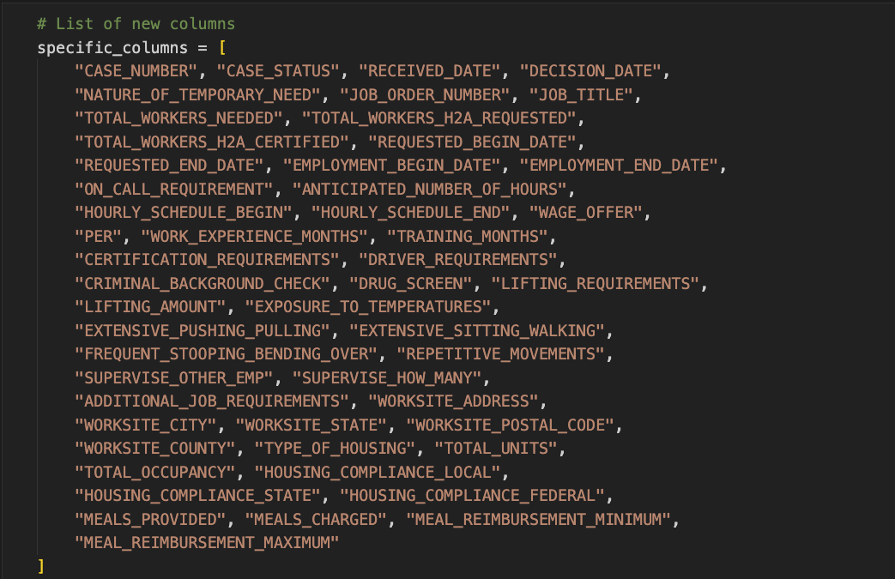
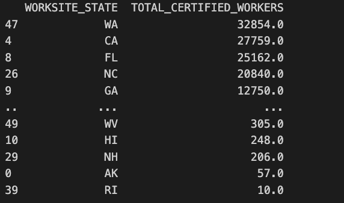
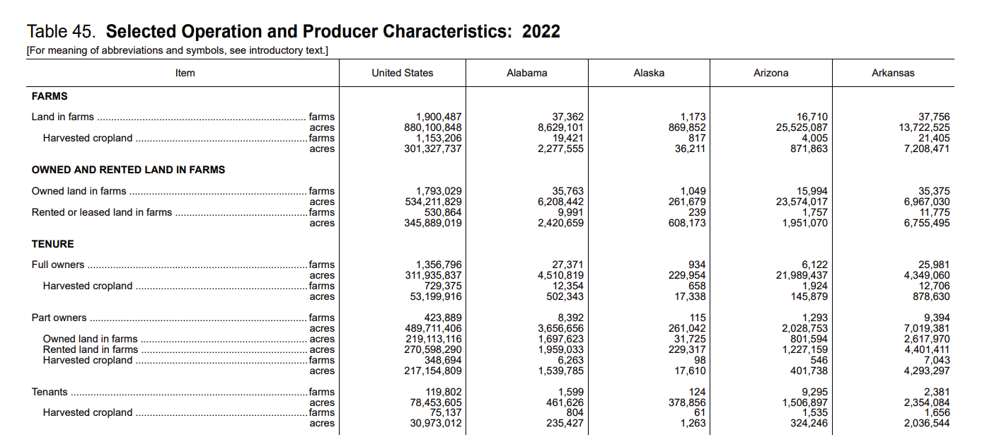
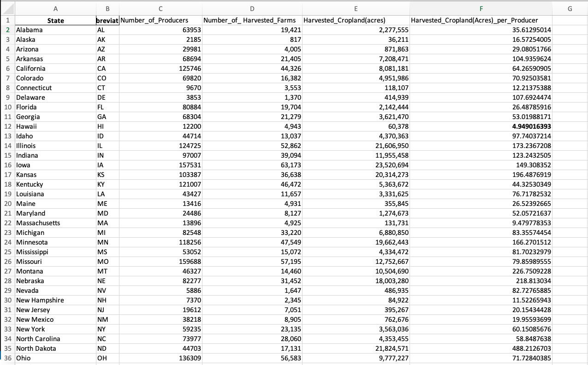
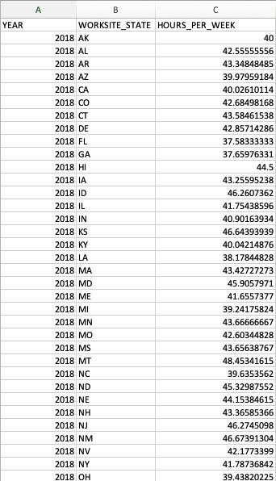
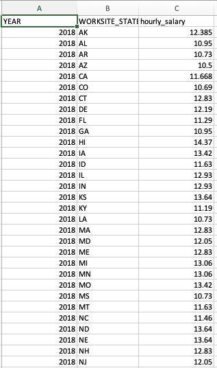
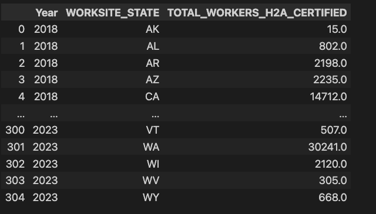

<div style="font-size: 29px">


# H2A Data Analysis Project
## January 17th Updates 
## Data Source
H2A Resources: [Department of Labor Foreign Labor Performance](https://www.dol.gov/agencies/eta/foreign-labor/performance) 
Here we can find H-2A Disclosure_Data_FY2024-Q4

**Note:** The reporting period covers October 1, 2023 through September 30, 2024 (Fiscal Year 2024), rather than the calendar year. For detailed column descriptions, refer to the [H2A Record Layout Documentation](https://www.dol.gov/sites/dolgov/files/ETA/oflc/pdfs/H-2A_Record_Layout_FY2024_Q4.pdf).

## Data Preparation and Analysis

### 1. Initial Data Loading
- Loaded the Excel file containing H2A application data
- Performed initial data inspection

### 2. Data Overview
```python

rows, columns = df.shape
print(f"Number of rows: {rows}")
print(f"Number of columns: {columns}")
```
\
As huge amount of columns names, I choose 50 columns that I think interesting. I also filter the DataFrame based on the condition. 
\
```python
new_df = df[specific_columns]
# Filter the DataFrame based on the condition
filtered_df = new_df[new_df["CASE_STATUS"] == "Determination Issued - Certification"]
```
So, the new number of rows is 16498 and the new number of columns is 51.

Since I am interested in the total workers for each state, so I group by the state and sum the total_workers_H2A_Certified. \
And I got (Ex: Total certified workers in MA this year is 499)\


\
Then I continue to find the general farm datasets. And I downloaded here(https://worldpopulationreview.com/state-rankings/farm-count-by-state)


```python
file_path = "/Users/hdjs7z/Downloads/farm-count-by-state-2024.csv"

# Use read_csv instead of read_excel
df_farmers = pd.read_csv(file_path)

# Display the first few rows
print(df_farmers.head())
```
The columns include:
'state', '**FarmCountByState_NumberOfFarms2023**', '**FarmCountByState_FarmOperations2023_Acres**', 'FarmCountByState_NumberOfFarms2022', '**FarmCountByState_NumberOfFarms_TotalSales2022_1000s**'


## Next steps:
1. Number of Famers for each state
2. Average Salary for H2A visa holders VS average salary for whole farmers for each state
3. How much acres do one person responsbile 
3. Merge the datasets to one
4. Main Crops and its pesticide usage


## January 17th - January 23rd Updates
## 1. Handle H2A datasets and solve the problem discussed in last meeting


Here I loaded 7 files from 2018 to 2024(From September 30th, 2017 to October 1st, 2024)<br>
And I did some date manipulation to extract information for 2018 to 2023 January 1st to the end of the year.<br> 


After I uploaded, I check some basic qualities of the files. 
The files after 2020(including it) uses the same rules, the column name and description are almost same.
In 2018 and 2019, there are 62 columns in each file. After 2020. It has more information, it includes about 138 columns.
And some column names are different. For example, in some files, it was documented as "NBR_WORKERS_REQUESTED", but in some file, it is listed as "TOTAL_WORKERS_H2A_REQUESTED"

I group by year and see
> 


## Find Farmers and Harvested Crop Datasets
In USDA, I found farmers dataset in (https://www.nass.usda.gov/Publications/AgCensus/2022/Full_Report/Volume_1,_Chapter_2_US_State_Level/st99_2_045_045.pdf)



And I collected the information including "Number_of_Produers", "Number_of_Harvested_Farms"...


## Next steps:
1. H2A workers percentage for each state
3. Dominant Crops for each state
3. Analyze revenue data.
</div>


<br>


# January 24th - February 8th Updates
# Create state level project(2018 -2023)
### Working hours for each week - average
<br>



### salary per hour - median
<br>
<p style="font-size: 20px;">There are some monthly salary in the files, so I assumed 4 weeks for each month, then I calculate hourly salary</p>
 
### The number of H2A workers



### The percentage of H2A workers
<br>
<p style="font-size: 20px;">Nevada has large-scale onion farms, and onions are labor-intensive, requiring hand planting, weeding, and harvesting, which leads to high demand for seasonal labor.</p>


## Next Steps:
<p style="font-size: 20px;">
1. Continue to work on state-level datasets(tax, minimum salary of that state...)<br>
2. Pesticides used in Dominant crops(reasons, texture, frequency, way...)</p>
</div>


# February 9th - Feb 22th Updates
# Standard Deviation in year level and state level 
## Year Level 


## State Level 

 

<span style="font-size:24px;">

# Comments Analysis 
## 1. Comments extraction by Yuri
## 2. Data Cleaning(Lowercasing， Removing Punctuation，Removing Extra Spaces）
## 3. Unsupervised Learning exploration: "Topic Modeling", specifically "Latent Dirichlet Allocation" (LDA)


Unsupervised learning: we don't directly give the model what we want to predict, we allow the model to discover patterns and structures in the data on its own.


<div>
  
</div>

### Topic 0:
**people** **child** **urge** **would** **law** **toxic** **protect** **state** **local** **pesticide**  

> People are urging the government to protect children from toxic pesticides through stronger local and state laws.
---

### Topic 1:
**supporting** **material** **attention** **without** **january** **matter** **period** **petition** **public** **comment**  

> A public petition calling for stricter pesticide regulations has gained significant attention this January.


---

### Topic 2:
**cause** **without** **substance** **serious** **parasite** **niagara** **canceled** **county** **doctor** **hour**  

> Doctors warn that exposure to certain pesticides can cause serious health issues, including chronic diseases.

---

### Topic 3:
**safety** **herbicide** **cancer** **health** **glyphosate** **life** **federal** **state** **pesticide** **soil**  

> Recent studies suggest that glyphosate, a commonly used herbicide, may be linked to an increased risk of cancer.

---

### Topic 4:
**government** **protect** **chemical** **local** **responsibility** **health** **pesticide** **use** **law** **state**  

> The government has a responsibility to regulate pesticide use and protect public health.


## 4. Deep Learning Model(PEGASUS Model)
This method is widely used for news summarization and academic paper summarization... and it can generate fully sentence.
<div>
  
</div>

But it is not appropriate here. 


## Next Steps:
<p style="font-size: 20px;">

</div>

# February 23rd - Mar 13th Updates

# More Comments Analysis

## 1. **Comments Extraction by Yuri (500 Comments)**  

## 2. **Data Cleaning**  
Before diving into the analysis, I cleaned up the data to make it easier to work with. Here’s what I did:  
- **Lowercasing**: I converted all the text to lowercase to keep things consistent.  
- **Removing Punctuation**: I got rid of punctuation marks to focus on the actual words.  
- **Removing Extra Spaces**: I trimmed any unnecessary spaces to make the text clean and uniform.  

## 3. **Removing Personal Information**  
Privacy is important, so I removed any personal information from the comments. Specifically:  
- I deleted everything after phrases like "I urge you..." to the end of the comment.  
- This included things like "Thank you," names, and addresses.  

<div>
  
</div>

## 4. **Summarizing Comments Using Deep Learning (T5 Model)**  
To make sense of the comments, I used a T5 deep learning model to summarize each one. Here’s an example of what a summarized comment looks like:  

**Example Summary**:  
*It is the job of any government to protect citizens from harm. It is not acceptable that people are being exposed to harmful pesticides.*  

## 5. **Unsupervised Learning Exploration: K-Means Clustering with TF-IDF**  
To group similar comments, **k-means clustering** was applied using **TF-IDF (Term Frequency-Inverse Document Frequency)** for feature extraction. The results are visualized below:

<div>
  
</div>

### Observations:  
- Even though I set three clusters, the comments in each group were pretty much saying the same thing.  
- I reread the email and googled that organization, I realized most of the comments were directed at a non-profit organization, mainly complaining about pesticides and asking for protection.  
- This made me think that most of the comments were essentially about the same topic.  

## 6. **Testing the Hypothesis: SBERT + Cosine Similarity**  
To test my idea, I used **SBERT (Sentence-BERT)** to calculate **cosine similarity** scores between pairs of comments. Here’s how I interpreted the scores:  

- **1.0**: Perfect Match (Identical sentences)  
- **0.8 - 1.0**: Highly Similar (Almost the same meaning)  
- **0.6 - 0.8**: Moderately Similar (Same main idea but different wording)  
- **0.4 - 0.6**: Somewhat Similar (Related but with different focus or expression)  
- **0.2 - 0.4**: Slightly Similar (Different topics but with some common elements)  
- **0.0 - 0.2**: Not Similar (Completely different content)  

## 7. **Random Pairwise Similarity Check**  
To get a better sense of how similar the comments were, I randomly picked two comments at a time and checked their similarity score. I did this over 20 times, and here’s what I found:  

<div>
  
</div>

### Findings:  
- More than 70% of the comment pairs had similarity scores between **0.6 - 0.8**, which means they were moderately to highly similar.  
- Some pairs were as high as **0.95**, while others were as low as **0.5**.  

## 8. **Conclusion**  
After all this analysis, I can summarize the 500+ comments like this:  
*You have been given the honor and responsibility to protect the environment of the United States. I urge you to protect Americans from harmful pesticides and reject any efforts to overturn state and local pesticide regulations.*  


# Mind Map (Blue = To Do)
Now that we have collected some data, to make the analysis more organized and to help us see what data still needs to be collected, I created a mind map.
<div>
  
</div>
<div>
  
</div>

# Next Steps:
1. Collecting Data<br>
2. Research Labor Protection


<br>
<br>
<br>

# Mar 14th - Mar 20th Updates

## Why I Created the "Mind Map"
1. To identify which columns or datasets need to be collected.  
2. After training the model, I want to determine which factor has a greater impact on the number of H2A workers — weather or government regulations.

## One More Thing About Comment Analysis
For our comment analysis, the case is not typical.  
When dealing with many independent comments or opinions about a product, we can use clustering + sentiment analysis to extract insights.

---

# How to Deal with Datasets

## Possible Target Variables
- Number of H2A workers  
- H2A worker percentage  
- Key factors affecting H2A worker demand

---

## Idea 1: Clustering and Separate Training
- Manually divide the U.S. into regions (e.g., Midwest, West Coast, East Coast) or economic zones, and train separate models for each.  
- Alternatively, use unsupervised learning (clustering) to automatically group similar states before training.

---

## Idea 2: Time Series Model
Models: XGBoost, ARIMA  
Advantages: Accurate, captures trends over time  
Disadvantages: Requires more data. I’m concerned that disruptions like COVID-19 or major policy changes may affect the trends and reduce prediction accuracy. (If possible, we can include these events as additional features to help the model adjust.)

If predicting 2025, we need 2018–2024 data for all features.  
If data is missing, we must replace or impute it.

---

## Idea 3: Feature Importance Analysis
Advantages: Helps policymakers understand what really influences H2A worker demand  

Methods:  
- Tree-based models (e.g., XGBoost, Random Forest)  
- SHAP (Shapley Additive Explanations)  
- Correlation analysis

Expected results:  
- Compare feature importance across states (e.g., dominant crops might matter more in California, but weather is more important in Massachusetts)  
- Compare feature importance across time (e.g., weather might be more important in 2018, but after 2023, policies could play a bigger role)

---

## Idea 4: Deep Learning Model (LSTM,....)
Advantages:
- Handles non-linear relationships well  
- Works with multiple variables  
- Learns time-based patterns automatically, without manual feature engineering

## Next step:
- I need more time to organize the datasets and explore each ideas.


<br>
<br>

# Mar 21th - Mar 27th Updates
This week, I focused on organizing and adding more variables that may influence or reflect H-2A labor patterns.

###  Climate Variables
- **Cooling Degree Days (CDD)**  
  - Column: `Mar 2023 - Feb 2024 Cooling Degree Days`  
  - **Why:** CDD reflects heat accumulation and indirectly represents the **length of the growing season**. A higher CDD implies a warmer climate, which typically extends the planting and harvesting period.
  
- **Precipitation**  
  - Column: `Mar 2023 - Feb 2024 Precipitation`  
  - **Why:** Precipitation is a direct measure of water availability and is used to approximate drought condition.

###  Economic Variables
- **State GDP (2018–2023)**  
  - **Why:** States with stronger economies might create more **job opportunities**, including H-2A positions.
  
- **Agricultural GDP (2018–2023)**  
  - **Why:** States with a high share of agricultural GDP are more likely to **demand farm labor**, making this a key predictor for H-2A workers.

### Geographic Variables
- **Border with Mexico** (`Yes/No`)  
  - **Why:** I observed that **Florida** has a low percentage of H-2A certified workers despite being a major agricultural state.  
    This might be because it's close to Mexico, so employers may prefer hiring **undocumented or local workers** who work for daily cash pay.  
    This column captures **border-state dynamics** which may influence H-2A usage.

---

##  Current Dataset Structure (By State)

###  Inherent Variables
- **Climate**
  - `Mar 2023 - Feb 2024 Cooling Degree Days`
  - `Mar 2023 - Feb 2024 Precipitation`
  * _Note: Alaska and Hawaii don't have these resources._*

  
- **Farming & Land**
  - `2022 Number_of_Producers`
  - `2022 Number_of_Harvested_Farms`
  - `2022 Harvested_Cropland (Acres)`
  - `2022 Harvested_Cropland (Acres) per Producer`  
    > *Note: While labeled as 2022, these variables are relatively stable over time.*

- **Geography**
  - `Border with Mexico or not` (`Yes/No`)

###  Working Conditions
- `2018–2023 Working Hours per Week`
- `2018–2023 Median Salary`
- `2018–2023 State GDP`
- `2018–2023 Agricultural GDP`

---

## Potential Target Variable

- **Primary:**  
  - `2018–2023 H-2A Certified Workers` (Yellow-highlighted rows)

- **Future target possibility:**  
  - `H-2A Worker Percentage` (e.g. Certified H-2A workers divided by total producers or total ag workers)

---

## Still Needed (To Add)

- **Most economically important crop(s)** for each state  
  > High-value crops often require more manual labor (e.g., berries, tobacco).

- **State income tax policy**  
  > Some states with no income tax (e.g., Florida, Texas) may be more appealing to workers or employers.

- **Labor Rights Protection**  
  > I'm not certain this is a strong indicator of whether a state attracts more H2A workers. Labor protections can be difficult for workers to access or fully understand, especially across states. In many cases, workers may prioritize job availability or earnings over legal protections. However, it's still worth considering, I will think about it and explore ways to quantify it if needed.

</span>